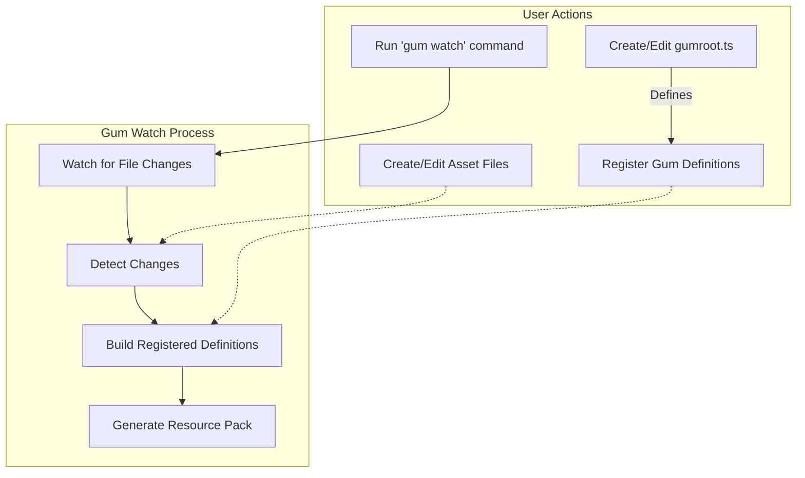

# How gum works
At it's core, you have a `gumroot.ts`. This is a Typescript file with the root definitions of your gum project. 

```typescript
import { register } from '@gec/gum-ffi'
import { textureReplacement, rpDefinition, TextureType } from '@gec/gum-ffi/rp'

// not a real lib, just for example purposes
import { BlockType } from '@minecraft/blocks'

register([
    rpDefinition({
        name: 'Resource Pack',
        uuid: '671679e5-faaa-4ffc-9899-41b75555d7b0',
        description: 'Gum testing'
    }),
    textureReplacement({
        type: TextureType.Block,
        replaces: BlockType.Dirt,
        path: './assets/dirt.png'
    })
]);
```

You have full flexibility on how you structure the project, as it's just Typescript using Deno at it's core, but it needs to have its items registered properly.
`rpDefinition` and `textureReplacement` can be called as a "gum Definition". This allows you the flexibility on how you can define things, so long as those are translated back to native gum definitions like `textureReplacement`.

On `gum watch`, it will watch for file changes, and build the registered definitions. 

