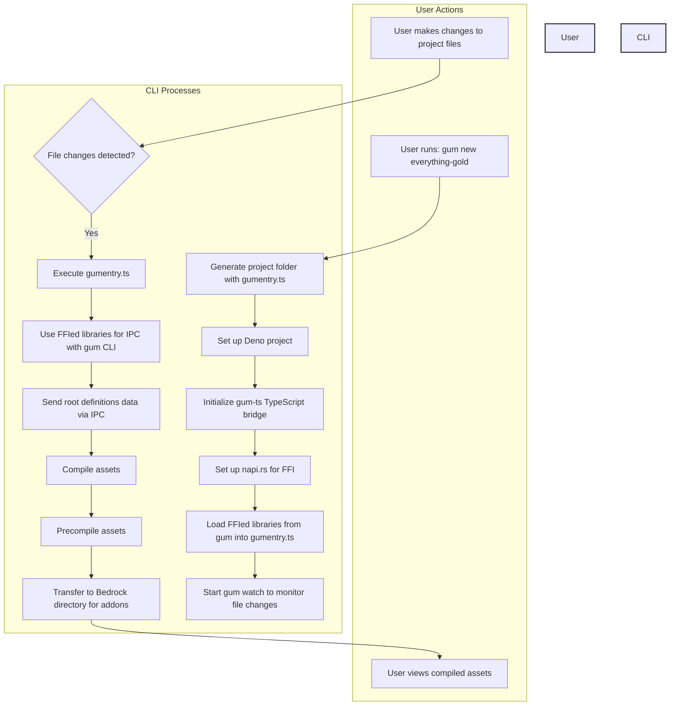

# How gum works

https://napi.rs/docs/introduction/simple-package

```mermaid
graph TD
    subgraph User Actions
        U1[User runs: gum new everything-gold]
        U2[User makes changes to project files]
        U3[User views compiled assets]
    end

    subgraph CLI Processes
        C1[Generate project folder with gumentry.ts]
        C2[Set up Deno project]
        C3[Initialize gum-ts TypeScript bridge]
        C4[Set up napi.rs for FFI]
        C5[Load FFIed libraries from gum into gumentry.ts]
        C6[Start gum watch to monitor file changes]
        C7{File changes detected?}
        C8[Execute gumentry.ts]
        C9[Use FFIed libraries for IPC with gum CLI]
        C10[Send root definitions data via IPC]
        C11[Compile assets]
        C12[Precompile assets]
        C13[Transfer to Bedrock directory for addons]
    end

    U1 --> C1
    C1 --> C2
    C2 --> C3
    C3 --> C4
    C4 --> C5
    C5 --> C6
    U2 --> C7
    C7 -->|Yes| C8
    C8 --> C9
    C9 --> C10
    C10 --> C11
    C11 --> C12
    C12 --> C13
    C13 --> U3

    style User Actions fill:#f9f,stroke:#333,stroke-width:2px
    style CLI Processes fill:#bbf,stroke:#333,stroke-width:2px
```